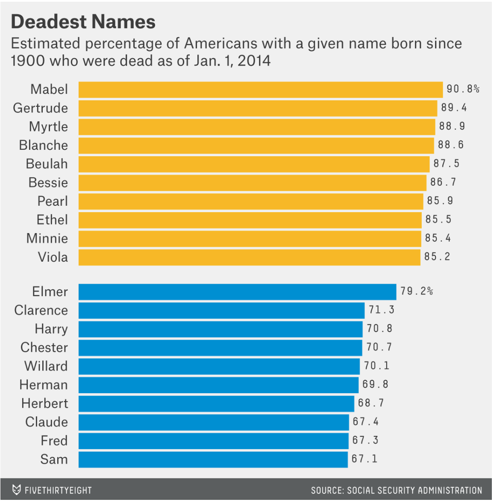

```{r install packages}
library(pacman)
p_load(tidyverse, macleish, nasaweather, palmerpenguins, mdsr)
```

# Problem 4 (Medium):

## The `macleish` package contains weather data collected every 10 minutes in 2015 from two weather stations in Whately, MA.

```{r}
#library(tidyverse)
#library(macleish)
head(whately_2015)
```

## Using `ggplot2`, create a data graphic that displays the average temperature over each 10-minute interval (`temperature`) as a function of time (`when`).

```{r}
ggplot(data = whately_2015, mapping = aes(x = when, y = temperature)) +
  geom_line()
```

# Problem 8 (Medium):

## Using data from the `nasaweather` package, use the `geom_path` function to plot the path of each tropical storm in the `storms` data table. Use color to distinguish the storms from one another, and use faceting to plot each `year` in its own panel.

```{r}
#library(nasaweather)
head(storms)

#storms %>% 
 # filter(type == "Tropical Storm") 
```

```{r}
bbox <- storms %>%
  select(lat, long) %>%
  map_df(range)          # using the purrr R package

bbox
```

```{r storms}
base_map <- map_data("world") %>% ggplot( aes(x = long, y = lat)) +
  geom_path(aes(group = group), color = "black", size = 0.1) +
  lims(x = bbox$long, y = bbox$lat)

storms <- storms %>% 
  unite("the_date", c(year, month, day), sep="-", remove="FALSE") %>%
  mutate(the_date = lubridate::ymd(the_date))

base_map <- base_map + geom_path(data = storms, aes(color = name, alpha = 0.01, size = wind),
                     arrow = arrow(length = unit(0.005, "inches"))) +
  facet_wrap(~year) 

base_map
```

# Problem 9 (Medium):

## Using the `penguins` data set from the `palmerpenguins` package:

### (a) Create a scatterplot of `bill_length_mm` against `bill_depth_mm` where individual species are colored and a regression line is added to each species. Add regression lines to all of your facets. What do you observe about the association of bill depth and bill length?

```{r}
#library(palmerpenguins)
head(penguins)
```

```{r penguins}

p1 <- penguins %>%
  ggplot(aes(x = bill_length_mm, y = bill_depth_mm, color = species, fill = species)) +
  geom_point() +
  geom_smooth(method = 'lm')


p1
```

### (b) Repeat the same scatterplot but now separate your plot into facets by `species`. How would you summarize the association between bill depth and bill length.

```{r penguins 2}
p2 <- penguins %>%
  ggplot(aes(x = bill_length_mm, y = bill_depth_mm)) +
  geom_point() +
  geom_smooth(method = 'lm') +
  facet_wrap( ~ species)

p2
```

# Problem 10 (Hard):

## Use the `make_babynames_dist()` function in the `mdsr` package to recreate the "Deadest Names" graphic from FiveThirtyEight (https://fivethirtyeight.com/features/how-to-tell-someones-age-when-all-you-know-is-her-name).



```{r deadest names, eval=FALSE}
#library(tidyverse)
library(mdsr)
babynames_dist <- make_babynames_dist()

deadest <- babynames_dist %>%
  filter(year >= 1900) %>%
  group_by(name, sex) %>%
  summarise(N = n(),
            total_est_alive_today = sum(est_alive_today),
            total = sum(n)) %>%
  mutate(percent_dead = 1 - (total_est_alive_today / total)) %>%
  filter(total > 50000) %>%
  arrange(desc(percent_dead)) %>%
  group_by(sex) %>%
  top_n(10)

ggplot(deadest, aes(reorder(name, percent_dead), percent_dead, fill = sex)) +
  geom_bar(stat = "identity") +
  geom_text(aes(y = percent_dead + 0.05), label = paste(round(deadest$percent_dead * 100, 1))) +
  coord_flip() +
  ggtitle("Deadest Names", subtitle = "Estimated % of Americans with a given name born since 1900\nwho were dead as of Jan. 1, 2014") #+
 # scale_x_discrete(NULL) + scale_y_continuous(NULL)# +
#  scale_fill_manual(values = c("#f6b900", "#008fd5")) +
 # theme(axis.text.x = element_blank(),
  #      panel.grid = element_blank(), 
   #     legend.position = "none")
```
